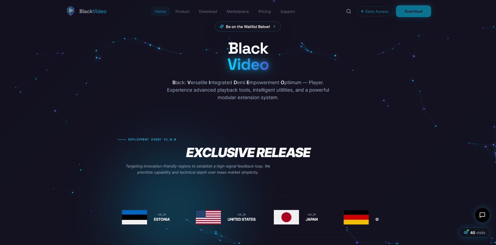

  

# **BlackVideo Official Hub** **Codename:** *Zephyra*

  
  
  
  
  

---

## Overview
Welcome to the **Official BlackVideo Centric Website**. This repository serves as the central hub for the BlackVideo (Zephyra) ecosystem, providing the official distribution point, versioning updates, and technical documentation for the video engine.

BlackVideo is a next-generation video player designed for power users, integrating advanced playback functionalities with a modular system to redefine the viewing experience.

### App Features
* **Intelligent Playback:** High-precision tools for seamless frame control and optimization.
* **Modular Architecture:** Fully customizable viewing via a sleek, integrated extension system.
* **Zephyra Engine:** Optimized decoding engine for ultra-high-definition and high-bitrate content.
* **Privacy-First:** Secure, local-first processing with verified SHA-256 integrity.

---

## Official Download
For your security, only download **BlackVideo** from this verified official hub. Avoid third-party mirrors or untrusted sites to ensure you are running a genuine build.

**Web Portal:** [BlackVideo Official Website](https://blackvideo-centric-site.onrender.com/)

### Platform Availability
| Platform | Status | Mirror 1 | Mirror 2 |
| :--- | :--- | :--- | :--- |
|  **Windows** | Pending | Unavailable | Unavailable |
|  **macOS** | Pending | Unavailable | Unavailable |
|  **Android** | Pending | [Unavailable](https://blackvideo-centric-site.onrender.com/) | Unavailable |
|  **Linux** | Pending | Unavailable | Unavailable |
|  **iOS** | Pending | Unavailable | Unavailable |

---

## Documentation
Access implementation guides and technical specifications for the Zephyra modular system.

**Wiki/Docs:** [Link to Documentation](https://linktodocumentation)  
**Developer Inquiries:** blackblazent.dev@gmail.com

---

## Community & Support
* **Discord:** [Join the BlackBlazent Server](https://discord.gg/tKFBwYuS)
* **Technical Support:** blackblazent.techsupport@gmail.com
* **GitHub Profile:** [BlackBlazent](https://github.com/BlackBlazent/.github)

---

## Legal & Copyright
### License

<a property="dct:title" rel="cc:attributionURL" href="https://github.com/LoneStamp/BlackVideo">BlackVideo Official Website</a> is licensed under <a href="https://creativecommons.org/licenses/by-nc-nd/4.0/?ref=chooser-v1" target="_blank" rel="license noopener noreferrer" style="display:inline-block;">CC BY-NC-ND 4.0</a>

### Privacy & TOS
By using the BlackVideo website and its associated software, you agree to our policies:
* [Privacy Policy](Link_to_Privacy_Policy)
* [Terms of Service](Link_to_Terms_of_Service)

---
**© 2026 BlackBlazent. All rights reserved.**