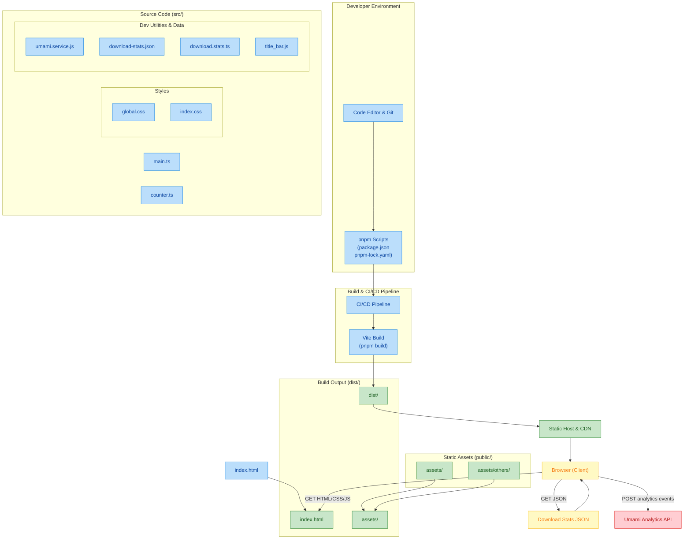

# BlackVideo Centric Official Website

The **BlackVideo official website** serves as the central digital platform for the BlackVideo application — a modern, integrated, and user-friendly video player solution. It acts as the main hub for users, contributors, and partners, providing access to downloads, updates, documentation, and community support.

This site enables seamless interaction between the core BlackVideo app, its developer network, and the broader user base — all seeking a powerful and versatile video playback experience.

---

## Diagram (In Repo)

## ⚖️ Status & Licensing

All content and source code in this repository are proprietary intellectual property of **BlackVideo**. Redistribution, modification, or commercial use without explicit prior written permission is strictly prohibited.

---

## 📬 Contact

For support, business inquiries, or developer collaboration:

- **Email**: blackblazent.dev@gmail.com  
- **Website**: [BlackBlazent](www-blackblazent-com.vercel.app)
