# **Appname:** *BlackVideo*  
## **Codename:** *zephyra*  
 
 <h5>🎯 <i>A video player with integration of wide variety of playback functionalities. </i></h5>

 

## Date created
12/23/2023 at 8:55 AM

## Date published
[000000] at

## Table of Contents
1. [Documentation](#documentation)
2. [Download](#download)
3. [Diagram](#diagram)
4. [License](#license)
5. [Contributing](#contributing)
6. [Support](#support)

## Documentation

[Documentation](https://linktodocumentation)

## Environment Variables

**Note**: APIs have request limits for optimal performance. Fill in your own API keys.

- The percentage levels indicate how strongly it is recommended for users to provide their own API keys.
- Below is a guide for the requirement level on whether to provide custom APIs:

| Requirement Level | Description           |
|-------------------|-----------------------|
| 0% - 20%          | No Need               |
| 20% - 40%         | Rarely Needed         |
| 40% - 60%         | Advisable             |
| 60% - 80%         | Recommended           |
| 80% - 100%        | Highly Recommended    |

| API         | Description                                         | Requirement Level   |
|-------------|-----------------------------------------------------|---------------------|
| Google      | <a href="">Google Search API</a>                    | 100% (Highly Recommended) |
| Yandex      |  <a href="">Yandex Search API</a>                   | 100% (Highly Recommended) |
| YouTube     |  <a href="">YouTube Data API</a>                    | 100% (Highly Recommended) |
| Facebook    |  <a href="">Facebook Graph API</a>                  | 60% (Recommended)         |
| Wikipedia   |  <a href="">Wikipedia API</a>                       | 40% (Advisable)           |
| IMDb        |  <a href="">IMDb API</a>                            | 60% (Recommended)         |
| Wiki Fandom |  <a href="">Wiki Fandom API</a>                     | 20% (Rarely Needed)       |

## 📥 Download  
Download **BlackMusic** only from the source provided below. For your safety, avoid downloading from untrusted websites.

Available on:  
---

| Platforms | Mirrors 1 | Mirror 2 |
|-----------|-----------|----------|
|  | [Unavailable](#) | [Unavailable](#) |  
|  | [Unavailable](#) | [Unavailable](#) |  
|  | [Unavailable](#) | [Unavailable](#) |  
|  | [Unavailable](#) | [Unavailable](#) |  
|  | [Unavailable](#) | [Unavailable](#) |
<!--https://github.com/LoneStamp99/Vvdo/assets/93658802/2c26d1c7-b2dc-4e42-a3d7-f2ab25e88b45-->

App Version History

| 🧩 Icon | 🔢 Version       | ✨ Details on the Version Features Include                                                                                                                                                             | 🔗 Direct Link for Version Access                                           |
| ------- | ---------------- | ----------------------------------------------------------------------------------------------------------------------------------------------------------------------------------------------------- | --------------------------------------------------------------------------- |
|       | v1.1.01.001.0001 | - Initial release  - Functional: | [v1.1.01.001.0001](https://example.com/downloads/v1.1.01.001.0001) |

## Diagram (Current)

```mermaid
graph TD

    36["User<br>External Actor"]
    37["FFmpeg<br>External Executable"]
    38["Cloudinary API<br>External Service"]
    5["User<br>External Actor"]
    6["FFmpeg<br>External Executable"]
    7["Cloudinary API<br>External Service"]
    subgraph 1["Cloudinary Integration<br>TypeScript"]
        31["Cloudinary Service<br>TypeScript"]
    end
    subgraph 2["Extension Management<br>TypeScript"]
        26["Extension Registry<br>TypeScript"]
        27["Extension Loader<br>TypeScript"]
        28["UI Extension Host<br>TypeScript"]
        29["Extension Disabler<br>TypeScript"]
        30["Computer Vision Extension<br>TypeScript"]
        %% Edges at this level (grouped by source)
        26["Extension Registry<br>TypeScript"] -->|loads| 27["Extension Loader<br>TypeScript"]
        26["Extension Registry<br>TypeScript"] -->|manages| 29["Extension Disabler<br>TypeScript"]
        27["Extension Loader<br>TypeScript"] -->|hosts| 28["UI Extension Host<br>TypeScript"]
        27["Extension Loader<br>TypeScript"] -->|integrates| 30["Computer Vision Extension<br>TypeScript"]
    end
    subgraph 3["BlackVideo Backend<br>Rust / Tauri"]
        23["main.rs<br>Rust"]
        24["Tauri Commands<br>Rust"]
        25["Rust Library<br>Rust"]
        %% Edges at this level (grouped by source)
        23["main.rs<br>Rust"] -->|defines| 24["Tauri Commands<br>Rust"]
        23["main.rs<br>Rust"] -->|uses| 25["Rust Library<br>Rust"]
    end
    subgraph 32["Cloudinary Integration<br>TypeScript"]
        62["Cloudinary Service<br>TypeScript"]
    end
    subgraph 33["Extension Management<br>TypeScript"]
        57["Extension Registry<br>TypeScript"]
        58["Extension Loader<br>TypeScript"]
        59["UI Extension Host<br>TypeScript"]
        60["Extension Disabler<br>TypeScript"]
        61["Computer Vision Extension<br>TypeScript"]
        %% Edges at this level (grouped by source)
        57["Extension Registry<br>TypeScript"] -->|loads| 58["Extension Loader<br>TypeScript"]
        57["Extension Registry<br>TypeScript"] -->|manages| 60["Extension Disabler<br>TypeScript"]
        58["Extension Loader<br>TypeScript"] -->|hosts| 59["UI Extension Host<br>TypeScript"]
        58["Extension Loader<br>TypeScript"] -->|integrates| 61["Computer Vision Extension<br>TypeScript"]
    end
    subgraph 34["BlackVideo Backend<br>Rust / Tauri"]
        54["main.rs<br>Rust"]
        55["Tauri Commands<br>Rust"]
        56["Rust Library<br>Rust"]
        %% Edges at this level (grouped by source)
        54["main.rs<br>Rust"] -->|defines| 55["Tauri Commands<br>Rust"]
        54["main.rs<br>Rust"] -->|uses| 56["Rust Library<br>Rust"]
    end
    subgraph 35["BlackVideo Frontend<br>Tauri / React / TypeScript"]
        39["main.tsx<br>TypeScript / React"]
        40["App.tsx<br>TypeScript / React"]
        41["Application Pages<br>TypeScript / React"]
        42["PageDisplayer<br>TypeScript"]
        43["Internationalization<br>TypeScript"]
        44["Global Modals<br>TypeScript / React"]
        45["Video Playback UI<br>TypeScript / React"]
        46["Video Playback Logic<br>TypeScript"]
        47["Video Recording<br>TypeScript / React"]
        48["Snapshot Capture<br>TypeScript"]
        49["Link Player<br>TypeScript"]
        50["Footer Components<br>TypeScript"]
        51["Video Metadata Handlers<br>TypeScript"]
        52["FFmpeg Dependency Checker<br>TypeScript"]
        53["FFmpeg Checker Loader<br>TypeScript"]
        %% Edges at this level (grouped by source)
        52["FFmpeg Dependency Checker<br>TypeScript"] -->|loads| 53["FFmpeg Checker Loader<br>TypeScript"]
        39["main.tsx<br>TypeScript / React"] -->|renders| 40["App.tsx<br>TypeScript / React"]
        40["App.tsx<br>TypeScript / React"] -->|displays| 41["Application Pages<br>TypeScript / React"]
        40["App.tsx<br>TypeScript / React"] -->|manages| 43["Internationalization<br>TypeScript"]
        40["App.tsx<br>TypeScript / React"] -->|opens| 44["Global Modals<br>TypeScript / React"]
        40["App.tsx<br>TypeScript / React"] -->|integrates| 45["Video Playback UI<br>TypeScript / React"]
        40["App.tsx<br>TypeScript / React"] -->|includes| 50["Footer Components<br>TypeScript"]
        40["App.tsx<br>TypeScript / React"] -->|checks| 52["FFmpeg Dependency Checker<br>TypeScript"]
        41["Application Pages<br>TypeScript / React"] -->|uses| 42["PageDisplayer<br>TypeScript"]
        45["Video Playback UI<br>TypeScript / React"] -->|controls| 46["Video Playback Logic<br>TypeScript"]
        46["Video Playback Logic<br>TypeScript"] -->|initiates| 47["Video Recording<br>TypeScript / React"]
        46["Video Playback Logic<br>TypeScript"] -->|triggers| 48["Snapshot Capture<br>TypeScript"]
        46["Video Playback Logic<br>TypeScript"] -->|handles| 49["Link Player<br>TypeScript"]
        46["Video Playback Logic<br>TypeScript"] -->|processes| 51["Video Metadata Handlers<br>TypeScript"]
    end
    subgraph 4["BlackVideo Frontend<br>Tauri / React / TypeScript"]
        10["Application Pages<br>TypeScript / React"]
        11["PageDisplayer<br>TypeScript"]
        12["Internationalization<br>TypeScript"]
        13["Global Modals<br>TypeScript / React"]
        14["Video Playback UI<br>TypeScript / React"]
        15["Video Playback Logic<br>TypeScript"]
        16["Video Recording<br>TypeScript / React"]
        17["Snapshot Capture<br>TypeScript"]
        18["Link Player<br>TypeScript"]
        19["Footer Components<br>TypeScript"]
        20["Video Metadata Handlers<br>TypeScript"]
        21["FFmpeg Dependency Checker<br>TypeScript"]
        22["FFmpeg Checker Loader<br>TypeScript"]
        8["main.tsx<br>TypeScript / React"]
        9["App.tsx<br>TypeScript / React"]
        %% Edges at this level (grouped by source)
        21["FFmpeg Dependency Checker<br>TypeScript"] -->|loads| 22["FFmpeg Checker Loader<br>TypeScript"]
        8["main.tsx<br>TypeScript / React"] -->|renders| 9["App.tsx<br>TypeScript / React"]
        9["App.tsx<br>TypeScript / React"] -->|displays| 10["Application Pages<br>TypeScript / React"]
        9["App.tsx<br>TypeScript / React"] -->|manages| 12["Internationalization<br>TypeScript"]
        9["App.tsx<br>TypeScript / React"] -->|opens| 13["Global Modals<br>TypeScript / React"]
        9["App.tsx<br>TypeScript / React"] -->|integrates| 14["Video Playback UI<br>TypeScript / React"]
        9["App.tsx<br>TypeScript / React"] -->|includes| 19["Footer Components<br>TypeScript"]
        9["App.tsx<br>TypeScript / React"] -->|checks| 21["FFmpeg Dependency Checker<br>TypeScript"]
        10["Application Pages<br>TypeScript / React"] -->|uses| 11["PageDisplayer<br>TypeScript"]
        14["Video Playback UI<br>TypeScript / React"] -->|controls| 15["Video Playback Logic<br>TypeScript"]
        15["Video Playback Logic<br>TypeScript"] -->|initiates| 16["Video Recording<br>TypeScript / React"]
        15["Video Playback Logic<br>TypeScript"] -->|triggers| 17["Snapshot Capture<br>TypeScript"]
        15["Video Playback Logic<br>TypeScript"] -->|handles| 18["Link Player<br>TypeScript"]
        15["Video Playback Logic<br>TypeScript"] -->|processes| 20["Video Metadata Handlers<br>TypeScript"]
    end
    %% Edges at this level (grouped by source)
    4["BlackVideo Frontend<br>Tauri / React / TypeScript"] -->|uploads to| 1["Cloudinary Integration<br>TypeScript"]
    4["BlackVideo Frontend<br>Tauri / React / TypeScript"] -->|manages| 2["Extension Management<br>TypeScript"]
    4["BlackVideo Frontend<br>Tauri / React / TypeScript"] -->|invokes commands| 3["BlackVideo Backend<br>Rust / Tauri"]
    21["FFmpeg Dependency Checker<br>TypeScript"] -->|communicates with| 3["BlackVideo Backend<br>Rust / Tauri"]
    5["User<br>External Actor"] -->|interacts with| 4["BlackVideo Frontend<br>Tauri / React / TypeScript"]
    3["BlackVideo Backend<br>Rust / Tauri"] -->|executes| 6["FFmpeg<br>External Executable"]
    31["Cloudinary Service<br>TypeScript"] -->|connects to| 7["Cloudinary API<br>External Service"]
    35["BlackVideo Frontend<br>Tauri / React / TypeScript"] -->|uploads to| 32["Cloudinary Integration<br>TypeScript"]
    35["BlackVideo Frontend<br>Tauri / React / TypeScript"] -->|manages| 33["Extension Management<br>TypeScript"]
    35["BlackVideo Frontend<br>Tauri / React / TypeScript"] -->|invokes commands| 34["BlackVideo Backend<br>Rust / Tauri"]
    52["FFmpeg Dependency Checker<br>TypeScript"] -->|communicates with| 34["BlackVideo Backend<br>Rust / Tauri"]
    36["User<br>External Actor"] -->|interacts with| 35["BlackVideo Frontend<br>Tauri / React / TypeScript"]
    34["BlackVideo Backend<br>Rust / Tauri"] -->|executes| 37["FFmpeg<br>External Executable"]
    62["Cloudinary Service<br>TypeScript"] -->|connects to| 38["Cloudinary API<br>External Service"]

```

## License

<a property="dct:title" rel="cc:attributionURL" href="https://github.com/LoneStamp/BlackVideo">BlackVideo</a> is licensed under <a href="https://creativecommons.org/licenses/by-nc-nd/4.0/?ref=chooser-v1" target="_blank" rel="license noopener noreferrer" style="display:inline-block;">CC BY-NC-ND 4.0</a>
 

## Contributing

Contributions are always welcome!

See `contributing.md` for ways to get started.

Please adhere to this project's `code of conduct`.

## Support

For support, email blackblazent.techsupport@gmail.com or join our [Discord](https://discord.gg/tKFBwYuS) channel.

## Privacy Policy and Terms of Service
To learn more about how we collect, store, and use user data, please read our Privacy Policy at [Link to Privacy Policy]. Our Terms of Service govern the use of BlackVivido or Vvdo and can be found at [Link to Terms of Service]. By using our app, you agree to these terms.

## Copyright
© 2025 BlackBlazent. All right reserved.
